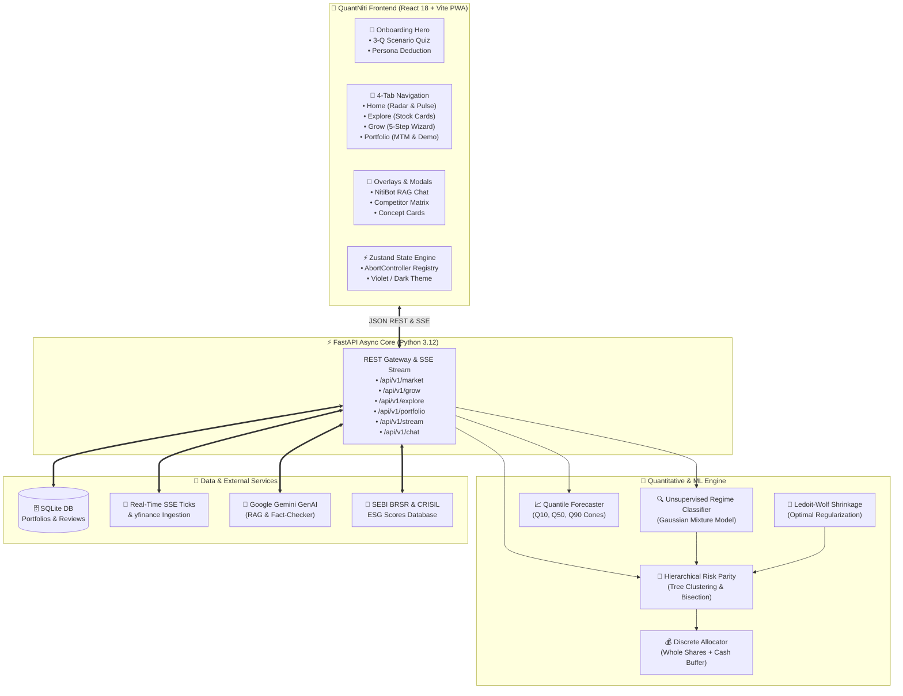

# QuantNiti (क्वान्टनीति) 🇮🇳
### AI-Driven Regime-Adaptive Portfolio Intelligence & Quantitative Decision Support System

[](https://www.python.org/)
[](https://fastapi.tiangolo.com/)
[](https://react.dev/)
[](https://vitejs.dev/)
[](https://tailwindcss.com/)
[](https://www.framer.com/motion/)
[]()
[]()

> **QuantNiti** bridges the deep divide in Indian retail finance between black-box speculative trading tips, high-commission bank wealth advisors (1.5%–2.5% AUM fees), and low-yielding fixed deposits. It provides retail investors with unsupervised machine learning market regime detection, multi-factor quantile growth forecasting, hierarchical risk parity (HRP) portfolio optimization, transparent explainable AI (XAI) Trust Cards, and contextual financial literacy.

---

## 📱 Visual Overview & Key Highlights

* **Electric Violet & Indigo Modern Design System:** Light-first default with dark mode toggle, non-boxy squircle containers (`rounded-3xl`), hairline border strokes, and smooth spring physics (`Framer Motion`).
* **Onboarding & Persona Quiz:** 3-question scenario-based quiz that evaluates behavioral loss tolerance and determines risk personas (Conservative, Balanced, Aggressive, ESG-Conscious) without jargon.
* **Guided Grow Wizard:** 5-step narrative flow (Capital → Horizon → Persona → Allocation Overview → Deep Dive) with tactile quick-pick chips, word-form reassurance (e.g. `₹50,000 — Fifty Thousand Only`), and discrete whole-share sizing.
* **Dual-State Portfolio Tracker:** Instant pre-populated **Demo Portfolio** for first-time visitors with realistic synthetic data, seamlessly transitioning to a live **Virtual Paper Portfolio** with real-time mark-to-market and regime-shift rebalance alerts.
* **Explore & Pro Tools:** Streamlined stock cards with visual regime suitability indicators, with the advanced **Quant Lab Backtester** (MA Crossover, RSI Reversion, Dual Momentum) neatly tucked behind a Pro Tools toggle.
* **NitiBot RAG Assistant:** Grounded conversational AI copilot answering portfolio questions citing live regime, risk bounds, and backtest data.

---

## 🏗️ System Architecture

QuantNiti follows a high-performance, decoupled architecture where a thin, reactive client interacts with a high-throughput Python quantitative backend:




---

## ⚡ Quick Start

### 1. Prerequisites
- **Python 3.12+**
- **Node.js 18+** & **npm**
- **uv** (recommended Python package manager)

### 2. Installation
```bash
# Clone the repository
git clone https://github.com/jayadityadev/majorproject.git
cd majorproject

# Install Python backend dependencies using uv
uv sync

# Install Node.js frontend dependencies
npm install
```

### 3. Running the Application
You can run the backend and frontend in development mode:

```bash
# Terminal 1: Launch FastAPI Backend Server
uv run uvicorn src.app.api.app:app --reload --port 8000

# Terminal 2: Launch Vite Frontend Dev Server
npm run dev
```

Or build the frontend assets for unified serving directly through FastAPI:
```bash
# Build React client into src/app/static/dist/
npm run build

# Start production server
uv run uvicorn src.app.api.app:app --port 8000
```
Open **`http://localhost:8000`** in your browser. (Switch to Chrome DevTools Device Mode for the mobile experience).

---

## 🧪 Testing & Verification

The project is engineered under strict Test-Driven Development (TDD) principles, featuring both complete frontend component test coverage and backend quant pipeline verification.

```bash
# Run Frontend Test Suite (Vitest + React Testing Library)
npm test

# Run Backend Unit & Integration Test Suite with Coverage
uv run pytest tests/ --cov=src/app
```

* **Frontend:** 132/132 unit & integration tests passing across 31 suites.
* **Backend:** 272/272 unit & integration tests passing with 99% line coverage.

---

## 📂 Project Structure

```
├── .scratch/                  # Local issue tracker & specification records
│   └── ui-redesign/          # Specifications, collaboration guides & ticket items
├── docs/                     # Architectural decision records (ADRs) & PRDs
│   ├── adr/                  # 12 ADRs covering ML, HRP, PWA, and RAG
│   └── PRD.md                # Master product requirement document
├── src/
│   ├── app/
│   │   ├── api/              # FastAPI application, middleware, and route handlers
│   │   ├── core/             # Configuration & Pydantic domain models
│   │   ├── data/             # Market data, RAG services, ESG scores, SQLite DB
│   │   ├── ml/               # Quantitative ML algorithms:
│   │   │   ├── regime_classifier.py    # GMM / HMM regime detection
│   │   │   ├── quantile_forecast.py    # Multi-horizon Q10/Q50/Q90 forecasting
│   │   │   ├── hrp.py                  # Hierarchical Risk Parity allocation
│   │   │   ├── covariance.py           # Ledoit-Wolf shrinkage
│   │   │   └── discrete_allocation.py  # Greedy whole-share integer rounding
│   │   └── static/           # PWA manifest, service worker, icons & dist/ bundle
│   └── frontend/             # Modern React 18 SPA codebase:
│       ├── components/       # UI components, layout shell, tabs & modals
│       ├── context/          # ThemeContext & global React providers
│       ├── hooks/            # useAbortableRequest, useAlertPolling hooks
│       ├── services/         # Market stream SSE & AbortController registry
│       └── store/            # Central Zustand application state store
└── tests/                    # Vitest frontend tests & Pytest backend tests
```

---

## 🎯 Core Mathematical & Algorithmic Methodologies

1. **Unsupervised Regime Classification:** Uses rolling 20-day returns, realized volatility, and India VIX to categorize macro equity regimes:
   $$\text{Regime} \in \{\text{Low-Vol Bull}, \text{High-Vol Bear}, \text{Sideways Consolidation}\}$$
2. **Ledoit-Wolf Covariance Shrinkage:** Replaces noisy sample empirical covariance with an asymptotically optimal structured target to avoid matrix inversion instability.
3. **Hierarchical Risk Parity (HRP):** Applies hierarchical tree clustering to the correlation matrix and conducts top-down recursive bisection, allocating risk inversely proportional to cluster variance without requiring matrix inversion.
4. **Quantile Growth Cones:** Evaluates probabilistic return distributions over defined holding horizons ($h \in \{1\text{M}, 3\text{M}, 6\text{M}, 12\text{M}\}$):
   $$Q_{0.10} \le Q_{0.50} \le Q_{0.90}$$
5. **Discrete Integer Share Allocations:** Sizing whole equity units:
   $$n_i = \left\lfloor \frac{w_i \cdot C}{P_i} \right\rfloor$$
   with unallocated balance retained in a dedicated cash buffer.

---

## 📄 License & Attribution
Developed for the Major Project initiative by Jayaditya Dev. See `docs/PRD.md` and `CONTEXT.md` for extended specifications and domain references.