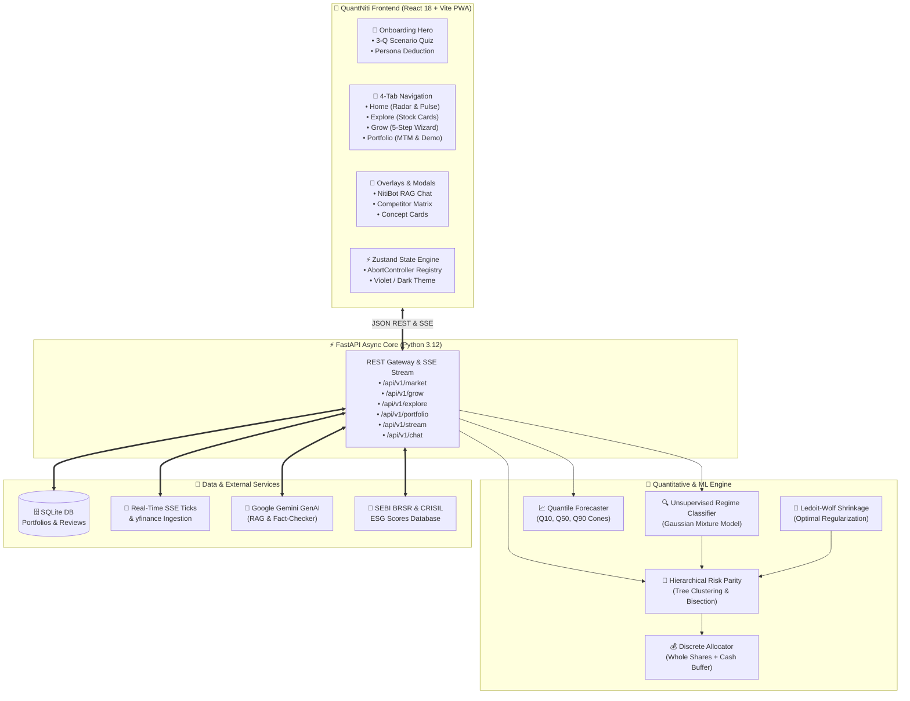

# QuantNiti (क्वान्टनीति) 🇮🇳
### AI-Driven Regime-Adaptive Portfolio Intelligence & Quantitative Decision Support System

[](https://www.python.org/)
[](https://fastapi.tiangolo.com/)
[](https://react.dev/)
[](https://vitejs.dev/)
[](https://tailwindcss.com/)
[](https://www.framer.com/motion/)
[]()
[]()
[]()

> [!NOTE]
> **QuantNiti** bridges the deep divide in Indian retail finance between black-box speculative trading tips, high-commission bank wealth advisors (1.5%–2.5% AUM fees), and low-yielding fixed deposits. It provides retail investors with unsupervised machine learning market regime detection, multi-factor quantile growth forecasting, hierarchical risk parity (HRP) portfolio optimization, transparent explainable AI (XAI) Trust Cards, and contextual financial literacy.

---

## 📱 Key Product Capabilities

* 🎨 **Electric Violet & Indigo Design System:** Modern squircle interface (`rounded-3xl`), hairline border glow strokes, and physics-based spring transitions (`Framer Motion`). Light mode default with persistent dark mode toggle.
* 🚀 **Onboarding & Persona Quiz:** 3-question scenario-based quiz that evaluates real behavioral loss tolerance and determines risk personas (*Conservative*, *Balanced*, *Aggressive*, *ESG-Conscious*) without confusing financial jargon.
* 🧙 **5-Step Guided Grow Wizard:** Multi-step narrative flow (Capital → Horizon → Persona → Allocation Overview → Deep Dive) with tactile quick-pick chips, word-form reassurance (e.g., `₹50,000 — Fifty Thousand Only`), and discrete whole-share sizing.
* 📊 **Dual-State Portfolio Tracker:** Instant pre-populated **Demo Portfolio** for first-time visitors with realistic synthetic data, seamlessly transitioning to a live **Virtual Paper Portfolio** with real-time mark-to-market and regime-shift rebalance alerts.
* 🔍 **Explore Tab & Hidden Pro Tools:** Streamlined stock cards with visual regime suitability badges, with the advanced **Quant Lab Backtester** (MA Crossover, RSI Reversion, Dual Momentum) cleanly tucked behind a Pro Tools accordion.
* 🤖 **NitiBot RAG Copilot:** Grounded conversational AI assistant answering portfolio questions citing live regime dynamics, risk bounds, and backtest data.

---

## 🏗️ System Architecture

QuantNiti follows a decoupled architecture where a reactive mobile-first client interacts with an asynchronous Python quantitative backend:



---

## ⚡ Quick Start

### 1. Prerequisites
- **Python 3.12+**
- **Node.js 18+** & **npm**
- **uv** (recommended high-speed Python package manager)

### 2. Installation
```bash
# Clone the repository
git clone https://github.com/jayaditya/majorproject.git
cd majorproject

# Install Python backend dependencies
uv sync

# Install Node.js frontend dependencies
npm install
```

### 3. Running Locally

#### Development Mode (Hot Reloading Frontend & Backend):
```bash
# Terminal 1: Launch FastAPI Backend Server
uv run uvicorn src.app.api.app:app --reload --port 8000

# Terminal 2: Launch Vite Frontend Dev Server
npm run dev
```

#### Production Unified Mode:
```bash
# Build React client into src/app/static/dist/
npm run build

# Start FastAPI production server (serves the precompiled Vite PWA)
uv run uvicorn src.app.api.app:app --port 8000
```
Open [http://localhost:8000](http://localhost:8000) in your browser. (Toggle Chrome DevTools Device Mode for the mobile experience).

---

## 🧪 Testing & Verification

The project is engineered under strict Test-Driven Development (TDD) principles, featuring frontend component test coverage and backend quant pipeline verification.

```bash
# Run Frontend Test Suite (Vitest + React Testing Library)
npm test

# Run Backend Unit & Integration Test Suite with Coverage
uv run pytest tests/ --cov=src/app
```

| Test Suite | Total Tests | Status | Coverage |
| :--- | :--- | :--- | :--- |
| **Frontend (Vitest + RTL)** | 132 Tests across 31 Suites | `PASSING` | Full Component Seams |
| **Backend (Pytest + AnyIO)** | 272 Tests across ML, API, Stream | `PASSING` | 99% Line Coverage |

---

## 📂 Project Structure

```
├── .scratch/                  # Local issue tracker & specification records
│   └── ui-redesign/          # Specifications, collaboration guides & ticket items
├── docs/                     # Architectural decision records (ADRs) & PRDs
│   ├── ARCHITECTURE.md       # Complete system architecture blueprint
│   ├── ML_PIPELINE.md        # Mathematical & econometric ML specification
│   ├── adr/                  # 12 Architectural Decision Records
│   └── PRD.md                # Master product requirement document
├── src/
│   ├── app/
│   │   ├── api/              # FastAPI application, middleware, and route handlers
│   │   ├── core/             # Configuration & Pydantic domain models
│   │   ├── data/             # Market data, RAG services, ESG scores, SQLite DB
│   │   ├── ml/               # Quantitative ML algorithms (Regime, HRP, Forecaster)
│   │   └── static/           # PWA manifest, service worker, icons & dist/ bundle
│   └── frontend/             # Modern React 18 SPA codebase:
│       ├── components/       # UI components, layout shell, tabs & modals
│       ├── context/          # ThemeContext & global React providers
│       ├── hooks/            # useAbortableRequest, useAlertPolling hooks
│       ├── services/         # Market stream SSE & AbortController registry
│       └── store/            # Central Zustand application state store
└── tests/                    # Vitest frontend tests & Pytest backend tests
```

---

## 🎯 Core Mathematical & Algorithmic Methodologies

<details>
<summary><b>1. Unsupervised Gaussian Mixture Model (GMM) Market Regime Classification</b></summary>

Uses rolling 20-day returns, realized volatility, Parkinson volatility, and India VIX to categorize macro equity regimes:

$$
\text{Regime} \in \{\text{Low-Vol Bull}, \text{High-Vol Bear}, \text{Sideways Consolidation}\}
$$

Centroids are ranked deterministically by their return-to-volatility ratio.
</details>

<details>
<summary><b>2. Ledoit-Wolf Covariance Matrix Regularization</b></summary>

Replaces ill-conditioned empirical sample covariance $\mathbf{S}$ with an optimal shrinkage combination against a constant-correlation target $\mathbf{F}$:

$$
\boldsymbol{\Sigma}_{\text{LW}} = \delta^* \mathbf{F} + (1 - \delta^*) \mathbf{S}
$$

Prevents matrix inversion singularity and extreme portfolio weight distortion.
</details>

<details>
<summary><b>3. Hierarchical Risk Parity (HRP) Tree Clustering</b></summary>

Applies hierarchical single-linkage tree clustering on correlation distances:

$$
d_{i,j} = \sqrt{\frac{1}{2}(1 - \rho_{i,j})}
$$

Conducts top-down recursive bisection, allocating risk inversely proportional to cluster variance without requiring covariance matrix inversion.
</details>

<details>
<summary><b>4. Multi-Horizon Quantile Growth Forecast Cones</b></summary>

Outputs bounded probabilistic return distributions across 1M, 3M, 6M, and 12M holding horizons with isotonic monotonicity guarantees:

$$
Q_{0.10} \le Q_{0.50} \le Q_{0.90}
$$
</details>

<details>
<summary><b>5. Discrete Integer Share Sizing & Cash Buffer</b></summary>

Converts continuous mathematical weights into executable whole-share quantities for Indian retail brokers (Zerodha, Groww):

$$
n_i = \left\lfloor \frac{w_i \cdot C}{P_i} \right\rfloor, \quad \text{Cash Buffer} = C - \sum_{i=1}^N n_i P_i
$$
</details>

---

## 📚 Technical Documentation Links

* 📘 [System Architecture Blueprint (`docs/ARCHITECTURE.md`)](docs/ARCHITECTURE.md)
* 🧠 [Machine Learning & Quantitative Pipeline (`docs/ML_PIPELINE.md`)](docs/ML_PIPELINE.md)
* 📑 [Product Requirements Document (`docs/PRD.md`)](docs/PRD.md)
* 🏷️ [Domain Model & Glossary (`CONTEXT.md`)](CONTEXT.md)

---

## 📄 License & Attribution
Developed for the Major Project initiative by **Jayaditya Dev**. Sourced market data provided via NSE indices and public BRSR/CRISIL reporting.