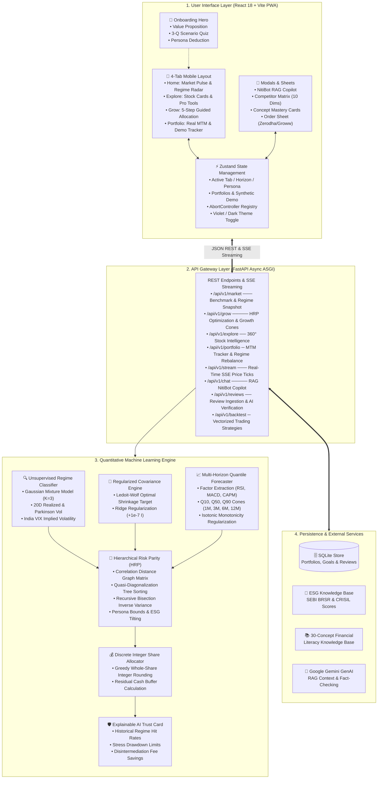

# QuantNiti: Complete Architectural Blueprint & System Design Document

**Document Version:** 2.0 (Post-React PWA Redesign)  
**Author:** Jayaditya Dev  
**Scope:** Architecture, Algorithmic Pipelines, Data Flow, UX State Engine, and Security

---

## 1. Executive Summary & Problem Context

In the Indian retail investment landscape, over 85% of market participants underperform benchmark indices or experience severe drawdowns during macro regime shifts. Novice investors face three severe dilemmas:
1. **Speculative Tip Culture & Finfluencer Misinformation:** Lack of quantifiable risk bounds or stress-tested probabilities.
2. **High-Fee Advisory Intermediation:** Traditional wealth managers and bank brokers charge 1.5%–2.5% in Assets Under Management (AUM) fees with built-in commission conflicts of interest.
3. **Black-Box Quantitative Platforms:** Tools like TradingView, Zerodha Streak, or Bloomberg require complex scripting and financial econometrics beyond the reach of standard retail users.

**QuantNiti** resolves this by democratizing institutional quantitative portfolio intelligence. It combines **unsupervised machine learning market regime detection**, **multi-factor quantile growth forecasting**, **Hierarchical Risk Parity (HRP)**, **Explainable AI (XAI) Trust Cards**, and **contextual microlearning** into a lightweight, installable Progressive Web Application (PWA) specifically optimized for mobile devices.

---




---

## 3. Mathematical & Quantitative Algorithmic Deep-Dive

### 3.1. Market Regime Classification (Unsupervised GMM)
Financial asset returns display structural breaks and heteroskedasticity. Rather than assuming static returns, QuantNiti detects latent macro market states using an unsupervised **Gaussian Mixture Model (GMM)**:
* **Feature Vector:** $\mathbf{x}_t = [R_{20, t}, \sigma_{20, t}, \text{VIX}_t, \Delta \text{VIX}_t]^T$, where $R_{20}$ is the 20-day cumulative logarithmic return of the NIFTY 50 index, $\sigma_{20}$ is the 20-day realized volatility, and $\text{VIX}$ represents the annualized implied volatility index.
* **Regime Probability Density:**
  $$P(\mathbf{x}_t) = \sum_{k=1}^K \pi_k \mathcal{N}(\mathbf{x}_t \mid \boldsymbol{\mu}_k, \boldsymbol{\Sigma}_k)$$
  Where $K=3$ corresponding to:
  1. **Low-Volatility Bull ($\sim 70-80\%$):** Subdued realized variance, positive drift $\to$ Allocates toward Momentum and Quality.
  2. **High-Volatility Bear ($\sim 10-15\%$):** Spiking volatility, negative drift $\to$ Tilts heavily toward Low-Vol, Defensive Equities, and Gold ETFs.
  3. **Sideways Consolidation ($\sim 10-15\%$):** Indeterminate drift, average variance $\to$ Value factors and mean-reversion.

### 3.2. Ledoit-Wolf Covariance Matrix Shrinkage
In small-sample regimes or high-dimensional portfolio universes, empirical sample covariance matrices $\mathbf{S}$ suffer from estimation noise and ill-conditioning. QuantNiti implements **Ledoit-Wolf shrinkage**:
$$\boldsymbol{\Sigma}_{\text{LW}} = \delta^* \mathbf{F} + (1 - \delta^*) \mathbf{S}$$
Where:
* $\mathbf{F}$ is the structured shrinkage target (constant correlation model).
* $\delta^* \in [0, 1]$ is the asymptotically optimal shrinkage intensity derived analytically to minimize quadratic loss under the Frobenius norm.

### 3.3. Hierarchical Risk Parity (HRP)
Traditional Markowitz Mean-Variance Optimization requires inverting the covariance matrix $\boldsymbol{\Sigma}^{-1}$, which magnifies estimation errors and concentrates weights into unstable extremes. QuantNiti uses **Marcos López de Prado’s Hierarchical Risk Parity (HRP)**:
1. **Tree Clustering:** Calculates correlation distances $d_{i,j} = \sqrt{\frac{1}{2}(1 - \rho_{i,j})}$ and clusters assets hierarchically into a dendrogram via single-linkage clustering.
2. **Quasi-Diagonalization:** Reorganizes the covariance matrix rows and columns such that correlated assets are positioned adjacent to one another.
3. **Recursive Bisection:** Allocates portfolio weights hierarchically down the tree:
   $$w_1 = w \cdot \alpha, \quad w_2 = w \cdot (1 - \alpha)$$
   $$\alpha = 1 - \frac{V_1}{V_1 + V_2}$$
   Where $V_1$ and $V_2$ represent the cluster variances:
   $$V_k = \tilde{\mathbf{w}}_k^T \boldsymbol{\Sigma}_k \tilde{\mathbf{w}}_k, \quad \tilde{w}_{k, i} = \frac{1/\sigma_i^2}{\sum_j 1/\sigma_j^2}$$

### 3.4. Multi-Horizon Quantile Growth Forecaster
Rather than deterministic single-price forecasts, QuantNiti outputs bounded probabilistic quantile growth cones:
* Target horizons: $h \in \{1\text{M}, 3\text{M}, 6\text{M}, 12\text{M}\}$.
* Evaluated at 3 percentiles:
  - **10th Percentile (Pessimistic $Q_{0.10}$):** Downside stress scenario for capital preservation.
  - **50th Percentile (Base $Q_{0.50}$):** Expected median compounding trajectory.
  - **90th Percentile (Optimistic $Q_{0.90}$):** Bullish upside boundary.

### 3.5. Greedy Integer Discrete Allocation
Retail brokers do not support fractional shares. Continuous weights $w_i$ are converted to executable whole share integers $n_i$ for a total capital $C$:
$$n_i = \left\lfloor \frac{w_i \cdot C}{P_i} \right\rfloor, \quad \text{Cash Buffer} = C - \sum_{i=1}^M n_i P_i$$

---

## 4. Frontend Architecture & Design Engineering

The frontend is built as an installable Progressive Web Application (PWA) with **React 18 + Vite + Tailwind CSS + Framer Motion**.

### 4.1. The 5-Step Guided Grow Experience
To eliminate cognitive overwhelm for novice investors, the Grow page replaces a traditional wall-of-forms with a segmented guided narrative:
* **Step 1 (Capital Allocation):** Smooth touch slider with instant word-form feedback (`₹ Fifty Thousand Only`), quick-tap preset chips (`+₹10k`, `+₹25k`, `+₹50k`, `+₹1L`), and micro-trust badges.
* **Step 2 (Time Horizon):** Contextual 2×2 card grid mapping durations to market stances (e.g. 6M Strategic Stance).
* **Step 3 (Risk Persona):** Visual persona cards pre-selected by the onboarding quiz (Conservative, Balanced, Aggressive, ESG-Conscious) with plain-language drawdown bounds.
* **Step 4 (Results Overview):** Asset allocation donut chart, discrete share summary, and 3-tier probabilistic Rupee growth scenarios.
* **Step 5 (Deep Dive):** 4-Pillar Trust Card, ESG Conscience breakdown, and benchmark comparison against 7% Bank FDs.

### 4.2. Universal Financial & Brand Color Palette
* **Accent Primary:** Electric Violet (`#7C3AED`) & Indigo (`#6366F1`) used for all brand chrome, active indicators, and interactive controls.
* **Financial Semantics:** Preserved universally to match global mental models:
  - **Profit / Outperformance:** Emerald Green (`#10B981`)
  - **Loss / Downside Drawdown:** Coral Red (`#EB5B3C`)
  - **Neutral / Benchmark Hurdle:** Amber Gold (`#F59E0B`)
* **Surfaces:**
  - **Light Mode (Default):** `#F8FAFC` canvas with `#FFFFFF` squircle cards.
  - **Dark Mode (Toggle):** `#0A0D14` obsidian black canvas with `#121124` violet-tinted containers.

### 4.3. Lifecycle Management & Race Condition Guards
* **`useAbortableRequest` Hook & Registry:** Every network request passes an `AbortSignal`. When users switch tabs or trigger new actions, previous pending network promises are aborted immediately.
* **Modal Stale-Data Guard:** Quick taps across stock cards verify `AppState.selectedStockSymbol === symbol` upon resolution before DOM injection.
* **Polling Intervals:** Polling timers are stored in React refs and strictly unmounted in `useEffect` return handlers.
* **Hardware Back Gesture:** Intercepts `popstate` events to dismiss modal sheets before triggering browser backward navigation.

---

## 5. Security, Reliability & Verification Matrix

| Area | Implementation Details | Verification Seam |
| :--- | :--- | :--- |
| **API Contract Validation** | Pydantic v2 data models with strict bounds checking on capital, horizon, and persona inputs. | `tests/integration/test_api_routes.py` |
| **SSE Resiliency** | Native EventSource client with exponential backoff reconnection (`1000ms * 1.5^n` capped at 30s). | `tests/frontend/unit/services/marketStream.test.ts` |
| **PWA Installability** | Standalone manifest, Service Worker caching of Vite production chunks, offline fallback page. | `tests/frontend/pwa/serviceWorker.test.ts` |
| **AI Fact Checking** | Automated legitimacy agent validating claimed returns in user reviews against historical backtest distributions. | `tests/unit/test_review_factchecker.py` |
| **Frontend Test Coverage** | 132 unit and integration tests across 31 suites in Vitest. | `npm test` |
| **Backend Test Coverage** | 272 unit and integration tests across quantitative ML, API, and streaming with 99% coverage. | `uv run pytest tests/` |

---

## 6. Deployment & Operations

### Production Container & Process Model
* **FastAPI Server:** Runs via Uvicorn ASGI workers:
  ```bash
  uv run uvicorn src.app.api.app:app --host 0.0.0.0 --port 8000 --workers 2
  ```
* **Frontend Assets:** Pre-compiled via Vite (`npm run build`) into `src/app/static/dist/`, served statically by FastAPI's `StaticFiles` with client routing fallbacks to `index.html`.
* **Database:** SQLite relational file database (`quantniti.db`) running in Write-Ahead Logging (WAL) mode for concurrent reads.
