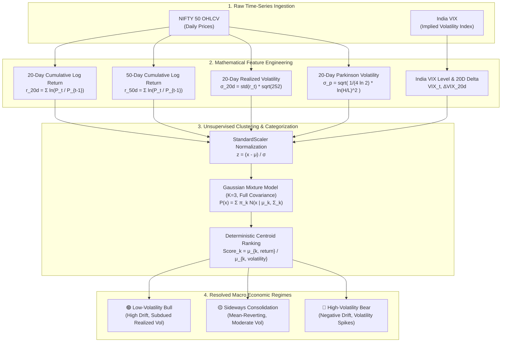
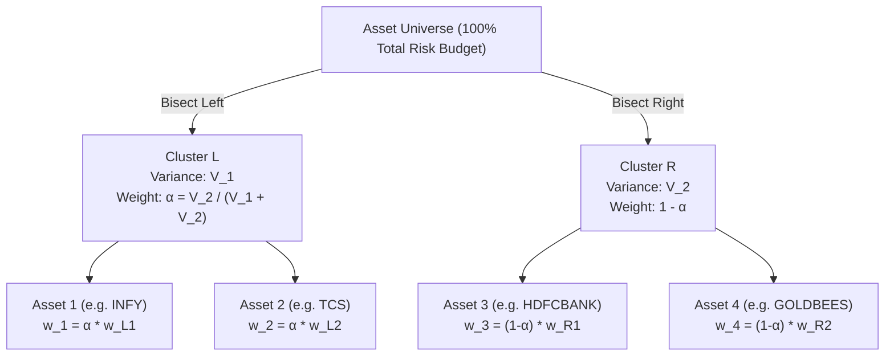
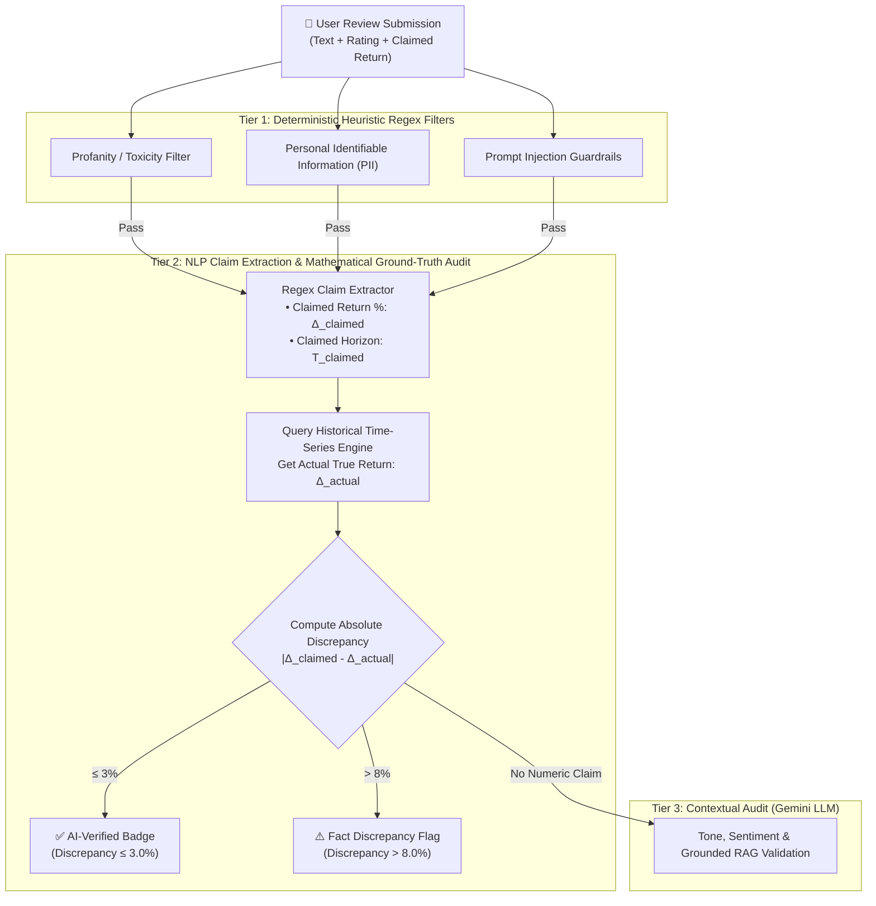
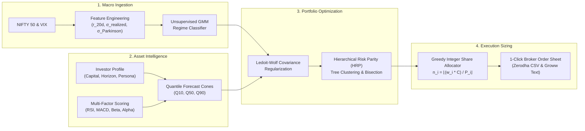

# QuantNiti: Machine Learning & Quantitative Finance Technical Specification
## An In-Depth Mathematical, Algorithmic, and Econometric Treatise on Market Regime Classification, Ledoit-Wolf Shrinkage, Hierarchical Risk Parity, and Probabilistic Growth Forecasting

**Domain:** Quantitative Finance, Machine Learning, Statistical Arbitrage, Mathematical Economics  
**Project:** QuantNiti (Iteration 2)  
**Author:** Jayaditya Dev  
**Target Audience:** Academic Reviewers, Quantitative Researchers, Evaluators, and Machine Learning Engineers  

---

## Table of Contents
1. [Foundational Problem Statement & Financial Econometrics](#1-foundational-problem-statement--financial-econometrics)
2. [Datasets, Ingestion Architecture & Preprocessing Justifications](#2-datasets-ingestion-architecture--preprocessing-justifications)
3. [Unsupervised Market Regime Classification Engine (GMM & Features)](#3-unsupervised-market-regime-classification-engine-gmm--features)
4. [Multi-Factor Asset Extraction & Quantile Growth Forecasting Cones](#4-multi-factor-asset-extraction--quantile-growth-forecasting-cones)
5. [Covariance Matrix Regularization: Ledoit-Wolf Shrinkage](#5-covariance-matrix-regularization-ledoit-wolf-shrinkage)
6. [Portfolio Optimization: Hierarchical Risk Parity (HRP) Algorithm](#6-portfolio-optimization-hierarchical-risk-parity-hrp-algorithm)
7. [Discrete Integer Share Allocation & Cash Buffer Modeling](#7-discrete-integer-share-allocation--cash-buffer-modeling)
8. [Geometric Brownian Motion (GBM) Long-Horizon Wealth Compounding](#8-geometric-brownian-motion-gbm-long-horizon-wealth-compounding)
9. [Autonomous AI NLP Ground-Truth Fact-Checking Agent](#9-autonomous-ai-nlp-ground-truth-fact-checking-agent)
10. [End-to-End Execution Flowchart & Mathematical Reference](#10-end-to-end-execution-flowchart--mathematical-reference)

---

## 1. Foundational Problem Statement & Financial Econometrics

Modern Portfolio Theory (MPT), originally formalized by Harry Markowitz (1952), asserts that rational investors can construct an efficient frontier of optimal portfolios maximizing expected return $\mathbb{E}[R_p]$ for a given level of variance $\sigma_p^2$:

$$\min_{\mathbf{w}} \frac{1}{2} \mathbf{w}^T \boldsymbol{\Sigma} \mathbf{w} \quad \text{s.t.} \quad \mathbf{w}^T \boldsymbol{\mu} = \mu_0, \quad \mathbf{w}^T \mathbf{1} = 1, \quad w_i \ge 0$$

Despite its theoretical beauty, MPT suffers from critical operational failures when applied to real-world financial markets:

### 1.1 The Markowitz "Error Maximizer" Curse
Inverting an empirical sample covariance matrix $\mathbf{S}^{-1}$ dramatically magnifies small estimation errors in asset variances and covariances. As proved by Michaud (1989), Mean-Variance Optimization often acts as an "error maximizer," outputting extreme, non-diversified corner solutions that severely underperform out-of-sample.

### 1.2 Non-Stationarity & Structural Regime Breaks
Financial time series violate the Independent and Identically Distributed (I.I.D.) assumption. Market dynamics exhibit distinct macro structural states (**regimes**) characterized by time-varying drift $\mu_t$, volatility clustering $\sigma_t$, and asymmetrical correlation breakdowns during liquidity crises (Cont, 2001). A single static covariance matrix ignores these macro shifts.

### 1.3 The Flaw of Single-Point Deterministic Targets
Traditional retail platforms output single price targets (e.g. *"Target ₹3,200"*), misleading investors by masking fat-tailed kurtosis and downside volatility. QuantNiti replaces deterministic predictions with bounded, probabilistic **quantile growth cones** ($Q_{0.10}, Q_{0.50}, Q_{0.90}$) conditioning risk parameters on the prevailing market regime.

---

## 2. Datasets, Ingestion Architecture & Preprocessing Justifications

QuantNiti operates on a curated multi-asset universe designed to capture the structural growth and defensive properties of the Indian economy.

### 2.1 Asset Universe Composition
1. **NIFTY 50 Equity Large-Cap Universe ($N=50$):** High-liquidity equities representing $>65\%$ of the National Stock Exchange (NSE) free-float market capitalization.
2. **Defensive Commodity ETFs:**
   * **GOLDBEES (Nippon India ETF Gold BeES):** Physical gold proxy exhibiting negative or near-zero correlation to equities during macro risk-off shocks.
   * **SILVERBEES (Nippon India ETF Silver BeES):** Industrial and monetary precious metal proxy offering inflation protection.
3. **Macro Benchmark & Volatility Indices:**
   * **`^NSEI` (NIFTY 50 Benchmark Index):** Market baseline for Capital Asset Pricing Model (CAPM) beta and alpha attribution.
   * **`^INDIAVIX` (India Volatility Index):** Implied annualized 30-day volatility derived from out-of-the-money NIFTY index option order books.

### 2.2 Why These Datasets?
* **Liquidity & Bid-Ask Tightness:** Eliminates execution slippage and market impact distortion during simulated trade execution.
* **Survivorship Bias Mitigation:** Restricts universe assets to established constituents with audited financial reporting.
* **Macro Regime Sensitivity:** Combining high-beta cyclical stocks, low-beta defensives (FMCG/Pharma), and precious metals ensures the portfolio optimizer has uncorrelated instruments to hedge downside volatility during bear markets.

### 2.3 Mathematical Data Preprocessing
Raw daily prices $P_t$ are transformed into continuously compounded logarithmic returns:

$$r_t = \ln\left(\frac{P_t}{P_{t-1}}\right)$$

*Log returns are strictly additive over time:*
$$r_{0, T} = \sum_{t=1}^T r_t$$
All missing observations are handled via forward-filling ($\text{ffill}$) followed by backward-filling ($\text{bfill}$) to eliminate lookahead bias without introducing spurious variance.

---

## 3. Unsupervised Market Regime Classification Engine (GMM & Features)

Traditional financial models categorize regimes using ad-hoc technical thresholds (e.g., price above/below 200-day SMA). QuantNiti deploys an **unsupervised Gaussian Mixture Model (GMM)** to discover latent structural market regimes directly from the joint distribution of returns, realized volatility, and implied volatility.




### 3.1 Feature Engineering Matrix
For each trading day $t$, QuantNiti constructs a multi-dimensional feature vector $\mathbf{x}_t \in \mathbb{R}^6$:
1. **20-Day Cumulative Log Return:** $R_{20, t} = \sum_{i=0}^{19} r_{t-i}$
2. **50-Day Cumulative Log Return:** $R_{50, t} = \sum_{i=0}^{49} r_{t-i}$
3. **20-Day Annualized Realized Volatility:**
   $$\sigma_{\text{realized}, t} = \sqrt{\frac{252}{19} \sum_{i=0}^{19} (r_{t-i} - \bar{r})^2}$$
4. **20-Day Parkinson High-Low Volatility:** A more efficient estimator than close-to-close volatility that captures intra-day price dispersion:
   $$\sigma_{\text{Parkinson}, t} = \sqrt{\frac{252}{20} \sum_{i=0}^{19} \frac{\left(\ln(H_{t-i} / L_{t-i})\right)^2}{4 \ln 2}}$$
5. **India VIX Level ($\text{VIX}_t$):** Measures annualized 30-day forward risk-neutral implied volatility.
6. **20-Day India VIX Change ($\Delta\text{VIX}_{20, t} = \text{VIX}_t - \text{VIX}_{t-20}$):** Captures implied volatility acceleration.

### 3.2 GMM Formulation & Expectation-Maximization (EM)
The probability density of the feature vector $\mathbf{x}_t$ is modeled as a linear superposition of $K=3$ multivariate Gaussian distributions:

$$p(\mathbf{x}_t \mid \boldsymbol{\Theta}) = \sum_{k=1}^K \pi_k \mathcal{N}(\mathbf{x}_t \mid \boldsymbol{\mu}_k, \boldsymbol{\Sigma}_k)$$

Where:
* $\pi_k \ge 0, \quad \sum_{k=1}^K \pi_k = 1$ are the mixing proportions (prior probabilities).
* $\boldsymbol{\mu}_k \in \mathbb{R}^6$ is the centroid of cluster $k$.
* $\boldsymbol{\Sigma}_k \in \mathbb{R}^{6 \times 6}$ is the full unconstrained covariance matrix for cluster $k$.

Parameters $\boldsymbol{\Theta} = \{\pi_k, \boldsymbol{\mu}_k, \boldsymbol{\Sigma}_k\}_{k=1}^K$ are estimated iteratively via the **Expectation-Maximization (EM)** algorithm:
* **E-step (Posterior Responsibilities):**
  $$\gamma_{t, k} = \frac{\pi_k \mathcal{N}(\mathbf{x}_t \mid \boldsymbol{\mu}_k, \boldsymbol{\Sigma}_k)}{\sum_{j=1}^K \pi_j \mathcal{N}(\mathbf{x}_t \mid \boldsymbol{\mu}_j, \boldsymbol{\Sigma}_j)}$$
* **M-step (Parameter Update):**
  $$N_k = \sum_{t=1}^T \gamma_{t, k}, \quad \boldsymbol{\mu}_k^{\text{new}} = \frac{1}{N_k} \sum_{t=1}^T \gamma_{t, k} \mathbf{x}_t$$
  $$\boldsymbol{\Sigma}_k^{\text{new}} = \frac{1}{N_k} \sum_{t=1}^T \gamma_{t, k} (\mathbf{x}_t - \boldsymbol{\mu}_k^{\text{new}})(\mathbf{x}_t - \boldsymbol{\mu}_k^{\text{new}})^T, \quad \pi_k^{\text{new}} = \frac{N_k}{T}$$

### 3.3 Deterministic State Mapping via Return-to-Volatility Centroids
Unsupervised clustering outputs cluster labels $\{0, 1, 2\}$ with random permutations across initialization runs. To establish rigorous, deterministic economic semantics, QuantNiti ranks the cluster centroids in original feature space using their **Return-to-Volatility Ratio**:

$$\text{Score}_k = \frac{\mu_{k, \text{log\_return\_20d}}}{\max(\mu_{k, \text{realized\_vol\_20d}}, 10^{-4})}$$

$$\begin{cases}
k_{\text{highest Score}} & \implies \textbf{Low-Volatility Bull} \quad (\mu > 0, \sigma \text{ low}) \\
k_{\text{lowest Score}} & \implies \textbf{High-Volatility Bear} \quad (\mu < 0, \sigma \text{ high}) \\
k_{\text{middle Score}} & \implies \textbf{Sideways Consolidation} \quad (\mu \approx 0, \sigma \text{ moderate})
\end{cases}$$

---

## 4. Multi-Factor Asset Extraction & Quantile Growth Forecasting Cones

Rather than using basic point regression, QuantNiti implements a multi-horizon quantile forecasting engine that models heteroskedastic return distributions across 4 investment horizons: $h \in \{1\text{M}, 3\text{M}, 6\text{M}, 12\text{M}\}$.

### 4.1 Quantitative Factor Extraction Engine
For each stock $i$, QuantNiti extracts an econometric factor profile across 4 classical investment pillars:

#### 1. Momentum Pillar
* **Returns:** 1M, 3M, 6M, and 12M cumulative returns.
* **14-Day Wilder Relative Strength Index (RSI):**
  $$\text{RS} = \frac{\text{EMA}_{14}(\text{Gain})}{\text{EMA}_{14}(\text{Loss}) + 10^{-9}}, \quad \text{RSI} = 100 - \frac{100}{1 + \text{RS}}$$
* **Moving Average Convergence Divergence (MACD):**
  $$\text{MACD} = \text{EMA}_{12}(P) - \text{EMA}_{26}(P), \quad \text{Signal} = \text{EMA}_9(\text{MACD})$$

#### 2. Volatility & Risk Pillar
* **Realized Volatilities:** 30-day and 90-day annualized rolling volatility.
* **Historical Maximum Drawdown:**
  $$\text{MDD}_t = \min_{s \le t} \left(\frac{P_s - \max_{\tau \le s} P_\tau}{\max_{\tau \le s} P_\tau}\right)$$
* **Bollinger Band Percentile ($\%B$):**
  $$\%B = \frac{P - \text{LowerBand}}{\text{UpperBand} - \text{LowerBand} + 10^{-9}}$$

#### 3. Market Sensitivity Pillar (CAPM)
Using ordinary least squares over rolling returns against the NIFTY 50 benchmark:
$$\beta_i = \frac{\text{Cov}(r_i, r_m)}{\text{Var}(r_m)}$$
$$\alpha_i = \bar{r}_i - \left[ r_f + \beta_i (\bar{r}_m - r_f) \right]$$

#### 4. Sustainability Pillar (ESG Conscience)
Sourced from audited SEBI BRSR (Business Responsibility and Sustainability Reporting) and CRISIL disclosures:
$$\text{ESG}_i = 0.35 \cdot \text{Env}_i + 0.35 \cdot \text{Soc}_i + 0.30 \cdot \text{Gov}_i$$

---

### 4.2 Multi-Factor Drift & Volatility Blending
The annualized expected drift $\mu_i$ is constructed via a weighted composite model with shrinkage constraints:

$$\mu_{\text{CAPM}} = r_f + \beta_i (R_m - r_f) + \alpha_{\text{annualized}}$$
$$\mu_{\text{Momentum}} = 0.4 \cdot R_{3\text{M}} + 0.3 \cdot R_{6\text{M}} + 0.3 \cdot R_{12\text{M}}$$
$$\mu_{\text{Trend}} = 0.5 \cdot \Delta\text{EMA}_{20/50} + 0.5 \cdot \Delta\text{EMA}_{50/200}$$
$$\mu_{\text{Blended}} = 0.50 \cdot \mu_{\text{CAPM}} + 0.30 \cdot \mu_{\text{Momentum}} + 0.20 \cdot \mu_{\text{Trend}}$$
$$\mu_i^* = \text{clip}(\mu_{\text{Blended}}, -0.30, 0.50)$$

Volatility is estimated using an exponentially weighted blend:
$$\sigma_i^* = \max(0.60 \cdot \sigma_{30\text{d}} + 0.40 \cdot \sigma_{90\text{d}}, 0.08)$$

---

### 4.3 Quantile Cones & Strict Monotonicity Enforcement
Under continuous Geometric Brownian Motion over horizon $\tau = \frac{\text{trading days}}{252}$:

$$S_\tau = S_0 \exp\left( \left(\mu_i^* - \frac{1}{2}{\sigma_i^*}^2\right)\tau + \sigma_i^* \sqrt{\tau} Z \right), \quad Z \sim \mathcal{N}(0, 1)$$

To guarantee that quantile forecasts preserve the mathematical invariant $Q_{0.10} \le Q_{0.50} \le Q_{0.90}$ under any market shock, QuantNiti applies **Isotonic Monotonicity Regularization**:

$$z_{0.90} = 1.28155, \quad z_{0.10} = -1.28155$$
$$Q_{0.50} = \exp(\mu_i^* \tau) - 1$$
$$Q_{0.10} = \exp\left((\mu_i^* - z_{0.90}\sigma_i^*)\tau\right) - 1$$
$$Q_{0.90} = \exp\left((\mu_i^* + z_{0.90}\sigma_i^*)\tau\right) - 1$$

$$\tilde{Q}_{0.10} = \min(Q_{0.10}, Q_{0.50}), \quad \tilde{Q}_{0.90} = \max(Q_{0.90}, Q_{0.50})$$

```
                  GROWTH CONE PROJECTION (Q10, Q50, Q90)
Return (%)
   ▲
+30│                                       * * * * *  Q90 (Optimistic 90th)
   │                             * * * * *
+15│                   * * * * * ─────────── Q50 (Base Case 50th)
   │         * * * * *
 0 ┼─────────*────────────────────────────── 0% Breakeven Line
   │                   * * * * *
-15│                             * * * * *
   │                                       * * * * *  Q10 (Pessimistic 10th)
   └─────────┬─────────┬─────────┬─────────┬────────▶
           Today      1M        3M        6M       12M Horizon (Days)
```

---

## 5. Covariance Matrix Regularization: Ledoit-Wolf Shrinkage

In high-dimensional equity portfolios, when the number of assets $N$ approaches the sample size $T$, the empirical sample covariance matrix:

$$\mathbf{S} = \frac{1}{T-1} \sum_{t=1}^T (\mathbf{r}_t - \bar{\mathbf{r}})(\mathbf{r}_t - \bar{\mathbf{r}})^T$$

becomes ill-conditioned with extreme eigenvalues. To prevent inversion instability and portfolio weight blowing, QuantNiti employs **Ledoit-Wolf Shrinkage (2004)**.

### 5.1 Formulation
Ledoit-Wolf shrinkage finds an optimal convex combination between the sample covariance $\mathbf{S}$ and a structured target matrix $\mathbf{F}$ (the constant-correlation target):

$$\boldsymbol{\Sigma}_{\text{LW}} = \delta^* \mathbf{F} + (1 - \delta^*) \mathbf{S}$$

Where:
* The constant correlation shrinkage target $\mathbf{F}$ has entries:
  $$f_{ii} = s_{ii}, \quad f_{ij} = \bar{\rho} \sqrt{s_{ii} s_{jj}} \quad (i \ne j)$$
  $$\bar{\rho} = \frac{2}{N(N-1)} \sum_{i < j} \frac{s_{ij}}{\sqrt{s_{ii} s_{jj}}}$$
* The optimal shrinkage intensity $\delta^* \in [0, 1]$ is derived analytically to minimize the expected Frobenius quadratic loss $\mathbb{E}[\|\boldsymbol{\Sigma}_{\text{LW}} - \boldsymbol{\Sigma}\|^2]$:
  $$\delta^* = \text{clip}\left( \frac{\kappa}{T}, 0, 1 \right)$$
  Where $\kappa = \frac{\pi - \rho}{\gamma}$, measuring the variance of the sample covariance entries relative to the target misspecification.

### 5.2 Ridge Regularization Layer
To ensure strict positive-definiteness under floating point operations:
$$\boldsymbol{\Sigma}_{\text{regularized}} = \frac{1}{2}(\boldsymbol{\Sigma}_{\text{LW}} + \boldsymbol{\Sigma}_{\text{LW}}^T) + 10^{-7} \cdot \mathbf{I}_N$$

---

## 6. Portfolio Optimization: Hierarchical Risk Parity (HRP) Algorithm

Rather than inverting the covariance matrix $\boldsymbol{\Sigma}^{-1}$, QuantNiti implements Marcos López de Prado’s **Hierarchical Risk Parity (HRP)**. HRP utilizes machine learning graph theory to group correlated assets into clusters and distributes risk top-down down the dendrogram tree.



### Stage 1: Correlation Metric & Tree Clustering
1. Calculate the Pearson correlation matrix $\mathbf{C}$ from $\boldsymbol{\Sigma}$.
2. Define the correlation distance metric:
   $$d_{i,j} = \sqrt{\frac{1}{2}(1 - \rho_{i,j})}$$
   *Property:* $d_{i,j} \in [0, 1]$, where $d_{i,j}=0$ represents perfect positive correlation ($\rho=1$), and $d_{i,j}=1$ represents perfect inverse correlation ($\rho=-1$).
3. Compute the Euclidean distance between distance vectors:
   $$\tilde{d}_{i,j} = \|\mathbf{d}_i - \mathbf{d}_j\|_2 = \sqrt{\sum_{k=1}^N (d_{k,i} - d_{k,j})^2}$$
4. Construct a hierarchical linkage matrix $\mathbf{Z} \in \mathbb{R}^{(N-1) \times 4}$ using single-linkage clustering.

### Stage 2: Quasi-Diagonalization
Reorganize rows and columns of the covariance matrix so that highly correlated assets are grouped along the main diagonal:
$$\mathbf{O} = \text{get\_quasi\_diag\_order}(\mathbf{Z})$$
$$\boldsymbol{\Sigma}_{\text{diag}} = \boldsymbol{\Sigma}[\mathbf{O}, \mathbf{O}]$$

### Stage 3: Recursive Bisection
Initialize weights $\mathbf{w} = \mathbf{1}_N$. For every sub-cluster bifurcating into two sub-branches $\mathbf{C}_1$ and $\mathbf{C}_2$:
1. Calculate inverse-variance allocation weights for each sub-cluster:
   $$\tilde{w}_{k, i} = \frac{1/\sigma_i^2}{\sum_{j \in \mathbf{C}_k} 1/\sigma_j^2}, \quad \forall i \in \mathbf{C}_k, \quad k \in \{1, 2\}$$
2. Compute the variance of each sub-cluster:
   $$V_k = \tilde{\mathbf{w}}_k^T \boldsymbol{\Sigma}_k \tilde{\mathbf{w}}_k$$
3. Compute the allocation factor $\alpha \in [0, 1]$:
   $$\alpha = 1 - \frac{V_1}{V_1 + V_2} = \frac{V_2}{V_1 + V_2}$$
4. Scale weights recursively:
   $$\mathbf{w}[\mathbf{C}_1] \leftarrow \mathbf{w}[\mathbf{C}_1] \cdot \alpha$$
   $$\mathbf{w}[\mathbf{C}_2] \leftarrow \mathbf{w}[\mathbf{C}_2] \cdot (1 - \alpha)$$

---

### 6.4 Risk Persona & ESG Allocation Constraints
To map institutional risk management to retail investors, QuantNiti enforces persona-driven concentration caps and ESG tilts:

| Risk Persona | Max Single Stock Weight | Min Asset Diversification | Sector Cap | ESG Tilting |
| :--- | :--- | :--- | :--- | :--- |
| **Conservative** | 18% | 8 Assets | 25% | Low-volatility screening |
| **Balanced** | 22% | 7 Assets | 30% | Equal multi-factor blend |
| **Aggressive** | 28% | 5 Assets | 40% | High-beta & momentum tilt |
| **🌱 ESG-Conscious** | 20% | 7 Assets | 25% | $\mathbf{w}_i \leftarrow \mathbf{w}_i \cdot \left(1 + \frac{\text{ESG}_i - 50}{100}\right)$ |

*Weight Capping Algorithm:* When a stock violates $w_i > w_{\max}$, excess weight $(w_i - w_{\max})$ is redistributed proportionally across uncapped assets until $\sum w_i = 1.0$ and $w_i \le w_{\max}, \forall i$.

---

## 7. Discrete Integer Share Allocation & Cash Buffer Modeling

Traditional portfolio models output continuous fractions (e.g. *"Buy 4.372 shares of Reliance Industries"*). Retail brokerage APIs (Zerodha Kite, Groww, Upstox) strictly reject fractional shares. QuantNiti implements a **Greedy Whole-Share Sizing Algorithm**:

### 7.1 Mathematical Sizing
Given total investable capital $C$ and continuous target weights $w_i^*$:
1. Target capital allocated per asset:
   $$C_i = w_i^* \cdot C$$
2. Whole share integer quantity:
   $$n_i = \left\lfloor \frac{C_i}{P_i} \right\rfloor = \left\lfloor \frac{w_i^* \cdot C}{P_i} \right\rfloor$$
3. Actual spent capital:
   $$C_{\text{spent}} = \sum_{i=1}^N n_i \cdot P_i$$
4. Unallocated Cash Buffer:
   $$\text{Cash Buffer} = C - C_{\text{spent}} \ge 0$$

### 7.2 Greedy Residual Reallocation
If residual cash permits purchasing additional shares of the highest-ranked underweight assets without violating risk persona limits:
$$\text{while } \text{Cash Buffer} \ge \min_{i}(P_i):$$
$$\text{Find } i^* = \arg\max_i \left( w_i^* - \frac{n_i P_i}{C} \right) \quad \text{s.t. } P_{i^*} \le \text{Cash Buffer}$$
$$n_{i^*} \leftarrow n_{i^*} + 1, \quad \text{Cash Buffer} \leftarrow \text{Cash Buffer} - P_{i^*}$$

---

## 8. Geometric Brownian Motion (GBM) Long-Horizon Wealth Compounding

To demonstrate the mathematical power of disciplined portfolio compounding, QuantNiti projects 10-year wealth trajectories under **Geometric Brownian Motion (GBM)** compared against a 7.0% Bank Fixed Deposit hurdle.

### 8.1 Stochastic Differential Equation (SDE)
Portfolio value $V_t$ follows the Itô drift-diffusion process:
$$dV_t = \mu_p V_t dt + \sigma_p V_t dW_t$$

By Itô's Lemma, the analytical solution for future capital value is:
$$V_t = V_0 \exp\left( \left(\mu_p - \frac{1}{2}\sigma_p^2\right) t + \sigma_p \sqrt{t} Z \right), \quad Z \sim \mathcal{N}(0, 1)$$

### 8.2 Monthly SIP Compounding with Step-Up Dynamics
For investors contributing monthly deposits $P_{\text{monthly}}$ with an annual step-up percentage $s$ (typically 10%):
$$P_{m} = P_{\text{monthly}} \cdot (1 + s)^{\lfloor (m-1)/12 \rfloor}$$

Future value accumulated over $M$ total months:
$$V_M = \sum_{m=1}^M P_m \left(1 + \frac{r_{\text{cagr}}}{12}\right)^{M - m + 1}$$

### 8.3 The Compounding Tipping Point
A core behavioral finance milestone: the month $t^*$ where **monthly compounding interest earnings exceed the monthly out-of-pocket deposit**:

$$t^* = \min \left\{ t \;\middle|\; V_{t-1} \cdot \left(\left(1 + \frac{r}{12}\right) - 1\right) \ge P_t \right\}$$

Reaching the Tipping Point visually signals to first-time investors that their accumulated capital generates more income each month than their active labor contribution.

---

## 9. Autonomous AI NLP Ground-Truth Fact-Checking Agent

QuantNiti introduces an automated 3-tier fact-checking agent verifying community user reviews in real time to prevent platform manipulation and fabricated profit claims:



### 9.1 Claim Extraction Logic
The agent executes regular expression heuristics:
$$\text{Return Claim } \Delta_{\text{claimed}} = \text{Regex}(\text{"}(?:[+-]?\d+(?:\.\d+)?)\s*(?:%|\text{percent})\text{"})$$
$$\text{Horizon Claim } T_{\text{claimed}} = \text{Regex}(\text{"}\b(1\text{M}|3\text{M}|6\text{M}|12\text{M}|1\text{Y}|2\text{Y})\b\text{"})$$

### 9.2 Ground-Truth Performance Cross-Examination
The claimed return is checked against historical price data over the claimed duration:
$$\text{Discrepancy} = |\Delta_{\text{claimed}} - \Delta_{\text{actual}}|$$

$$\text{Review Status} = \begin{cases}
\textbf{Verified} & \text{if } \text{Discrepancy} \le 3.0\% \\
\textbf{Subjective} & \text{if No Quantitative Claim Found} \\
\textbf{Flagged} & \text{if } \text{Discrepancy} > 8.0\% \quad (\text{Fabricated Performance})
\end{cases}$$

---




### Key Mathematical References
1. **López de Prado, M. (2016).** *Building Diversified Portfolios that Outperform Out-of-Sample.* The Journal of Portfolio Management, 42(4), 59-69.
2. **Ledoit, O., & Wolf, M. (2004).** *A well-conditioned estimator for large-dimensional covariance matrices.* Journal of Multivariate Analysis, 88(2), 365-411.
3. **Parkinson, M. (1980).** *The Extreme Value Method for Estimating the Variance of the Rate of Return.* The Journal of Business, 53(1), 61-65.
4. **Markowitz, H. (1952).** *Portfolio Selection.* The Journal of Finance, 7(1), 77-91.
5. **Cont, R. (2001).** *Empirical properties of asset returns: stylized facts and statistical issues.* Quantitative Finance, 1(2), 223-236.
